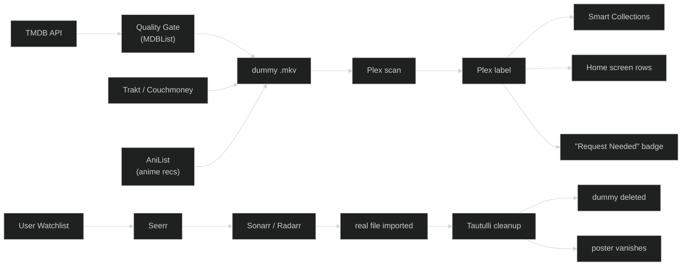

# plexflixarr

Custom streaming service discovery injection into Plex. Browse trending content from Netflix, Hulu, Apple TV+, and Max — filtered by quality ratings — directly as Plex home screen rows. Add something to your Watchlist, and Seerr downloads it. The dummy disappears automatically when the real file arrives.

---

## How It Works



**Key constraint:** Kometa only organises items already in the Plex library. All content population is handled by the ingestion service — Kometa never triggers downloads.

---

## Prerequisites

You need the following services running before plexflixarr can operate:

| Service | Role |
|---------|------|
| **Plex Media Server** | Hosts both your real and discovery libraries |
| **Sonarr** | Downloads and manages TV shows |
| **Radarr** | Downloads and manages movies |
| **Seerr** | Converts Plex Watchlist additions into Sonarr/Radarr requests |
| **Tautulli** | Watches Plex events and calls the cleanup endpoint |
| **Kometa** | Reads Plex labels and builds Smart Collection rows (included in `docker-compose.yml`) |
| **PlexTraktSync** | Syncs your watch history to Trakt (included in `docker-compose.yml`) |
| **PlexAniSync** | Syncs your anime watch history to AniList for personalised anime recommendations |

---

## Quick Start

```bash
# 1. Install dependencies
uv sync

# 2. Configure environment
cp .env.example .env
# Edit .env with your API keys and media paths

# 3. Start the service
uv run uvicorn src.main:app --host 0.0.0.0 --port 8742

# 4. Trigger ingestion
curl -s -X POST http://localhost:8742/ingestion/run

# 5. Trigger cleanup manually (normally called by Tautulli)
curl -s -X POST http://localhost:8742/dummy_cleanup \
  -H "Content-Type: application/json" \
  -d '{"media_type": "episode", "show_name": "Stranger Things"}'
```

### Running via Docker

```bash
# Start the plexflixarr service + Kometa + PlexTraktSync
docker compose up -d

# Trigger ingestion once
curl -s -X POST http://localhost:8742/ingestion/run
```

### Scheduling Nightly Ingestion

Add to your host crontab (`crontab -e`):

```
0 2 * * * curl -s -X POST http://localhost:8742/ingestion/run
```

---

## API Reference

| Method | Endpoint | Description |
|--------|----------|-------------|
| `GET` | `/health` | Service health check |
| `POST` | `/ingestion/fetch` | Fetch raw candidates from TMDB + Trakt (no filtering, no file writes) |
| `POST` | `/ingestion/run` | Run the full ingestion pipeline in the background |
| `POST` | `/dummy_cleanup` | Delete a dummy file and remove it from Plex |

### Inspect fetched candidates

```bash
curl -s -X POST http://localhost:8742/ingestion/fetch \
  | jq -r '["TYPE","TITLE","YEAR","LABELS"], ["----","-----","----","------"], (.[] | [.media_type, .title, (.year // "?"), (.labels | join(", "))]) | @tsv' \
  | column -t -s $'\t'
```

---

## Setup

### 1. TMDB (The Movie Database)

**Purpose:** Fetches the top trending content per streaming service using JustWatch's backend data — free and unlimited.

1. Go to [themoviedb.org](https://www.themoviedb.org/) and create a free account.
2. Verify your email and log in.
3. Click your profile icon → **Settings** → **API** (left sidebar).
4. Click **Create** or **Request an API Key** → choose **Developer** (free).
5. Fill out the brief form (e.g. "Personal script to organise my home media server").
6. Copy the **API Key (v3 auth)**.

**Where it goes:** `TMDB_API_KEY` in `.env`.

---

### 2. Trakt.tv

**Purpose:** The central hub for your watch history. PlexTraktSync feeds viewing data into Trakt; the ingestion service pulls personalised recommendations out via Couchmoney.

1. Go to [trakt.tv](https://trakt.tv/) and create a free account. Do not pay for VIP.
2. Click your profile icon → **Settings** → **Your API Apps** (bottom of left sidebar).
3. Click **New Application**.
   - **Name:** "Plex Discovery Engine" (or any name you like).
   - **Redirect URI:** `urn:ietf:wg:oauth:2.0:oob`
4. Click **Save App**.
5. Copy the **Client ID**.

**Where it goes:** `TRAKT_CLIENT_ID` in `.env`.

---

### 3. Couchmoney.tv

**Purpose:** Reads your Trakt watch history and generates a daily "Recommended for Me" list. The ingestion service pulls this list to create personalised dummy files.

1. Go to [couchmoney.tv](https://couchmoney.tv/).
2. Click **Login with Trakt** and authorise the connection.
3. Couchmoney generates default lists (typically "TV Recommendations" and "Movie Recommendations").
4. Go to your Trakt profile → **Lists**. Find the Couchmoney lists and note their **slugs** (the URL-friendly name in the list URL, e.g. `recommendations-movies`, `recommendations-shows`).

The service uses `recommendations-movies` and `recommendations-shows` by default. If your slugs differ, override in `src/clients/trakt_client.py` or pass them to `fetch_recommendations()`.

---

### 4. MDBList

**Purpose:** Quality gate. Every item fetched from TMDB is checked against MDBList's rating database (Trakt score and Rotten Tomatoes) before a dummy file is created. Free tier allows 1,000 lookups per day, which comfortably covers a nightly run.

1. Go to [mdblist.com](https://mdblist.com/) and create a free account.
2. Click your profile icon → **API Key** (or navigate to Settings → API).
3. Copy your API key.

**Where it goes:** `MDBLIST_API_KEY` in `.env`.

Thresholds (defaults: Trakt ≥ 70 or RT ≥ 60):
- `MDBLIST_MIN_TRAKT` — minimum Trakt score (0–100)
- `MDBLIST_MIN_RATING` — minimum Rotten Tomatoes score (0–100)

---

### 5. Local Server Credentials

#### Plex Token

1. Open Plex Web and play any media item.
2. Click the `…` menu on the item → **Get Info** → **View XML**.
3. In the URL bar, find `X-Plex-Token=` — copy the value after the `=`.

**Where it goes:** `PLEX_TOKEN` in `.env`. Also update `kometa-config/config.yml` → `plex.token`.

---

### 6. Plex Library Setup

Create two new libraries to hold dummy files, isolated from your real media.

1. In Plex Web, click **More** → **+** (Add Library).
2. **Discover Movies:** Type = Movies, folder = your `DISCOVER_MOVIES_PATH` value (e.g. `/media/discover_movies`).
3. **Discover Shows:** Type = TV Shows, folder = your `DISCOVER_SHOWS_PATH` value (e.g. `/media/discover_shows`).
4. For both libraries, go to **Settings** → uncheck **Include library in dashboard** to prevent dummy files from appearing in Continue Watching or global Recently Added.

---

### 7. Seerr

Seerr must be blind to the discovery libraries so it treats Watchlist requests as genuinely missing media.

1. Open Seerr → **Settings** → **Plex**.
2. In the library list, **uncheck** both **Discover Movies** and **Discover Shows**.
3. Save.

---

### 8. Kometa

Kometa reads Plex labels applied by the ingestion service and builds Smart Collections pinned to the Plex home screen.

1. Update `kometa-config/config.yml`:
   - Set `plex.url` to your Plex server address (e.g. `http://192.168.1.100:32400`).
   - Set `plex.token` to your Plex token.
2. **Overlay badge:** Replace the placeholder PNG at `kometa-config/assets/overlays/request_needed_icon.png` with a transparent PNG of your preferred "Request Needed" badge design.
3. Start Kometa via Docker:
   ```bash
   docker compose up -d kometa
   ```
4. Kometa will run once on startup (`KOMETA_RUN=true`). To schedule recurring runs, remove that env var and set `KOMETA_TIME` (e.g. `KOMETA_TIME=03:00`).

Collections defined in `kometa-config/discovery_ui.yml` will appear as horizontal rows on your Plex home screen after the first successful run.

---

### 9. PlexTraktSync

PlexTraktSync keeps Trakt's watch history in sync with Plex so Couchmoney generates accurate recommendations.

**Important:** restrict it to your **real** libraries only. If it scans the discovery libraries, 1-second dummy files will pollute your Trakt history.

1. Start the container:
   ```bash
   docker compose up -d plextraktsync
   ```
2. Run the one-time authentication wizard:
   ```bash
   docker exec -it plextraktsync plextraktsync
   ```
   Follow the prompts to authorise Trakt (browser PIN) and Plex.
3. Open `./plextraktsync/config/config.yml` and restrict to real libraries:
   ```yaml
   libraries:
     - Movies       # replace with your exact Plex library names
     - TV Shows
     # Do NOT include your anime library here — AniList (via PlexAniSync) handles anime.
     # Trakt's anime database is fragmented; mixing it in causes log errors and shallow recs.
   ```
4. Restart the container:
   ```bash
   docker compose restart plextraktsync
   ```

---

### 10. Tautulli — Cleanup Trigger

Tautulli calls the `POST /dummy_cleanup` endpoint the moment a real file is imported into Plex, removing the corresponding dummy.

Create **two** Webhook Notification Agents — one for shows, one for movies.

**Agent 1 — TV Shows:**

1. Tautulli → **Settings** → **Notification Agents** → **Add a new notification agent** → **Webhook**.
2. **Configuration tab:**
   - **Webhook URL:** `http://localhost:8742/dummy_cleanup`
   - **Webhook Method:** `POST`
   - Description: `Cleanup Dummy Shows`
3. **Triggers tab:** check **Recently Added**.
4. **Conditions tab:**
   - `Library Name` **is** `<your real TV library name>` (e.g. `TV Shows`)
   - This prevents the agent from firing when the ingestion service adds dummy files.
5. **Data tab** → expand **Recently Added** → paste into the **JSON Data** field:
   ```json
   {"media_type": "{media_type}", "title": "{title}", "show_name": "{show_name}"}
   ```
   Tautulli sends `{media_type}` as `"episode"` for TV events. The endpoint uses `show_name` when `media_type` is `"episode"` and `title` when it is `"movie"`.
6. **Save**.

**Agent 2 — Movies:**

Repeat the above with:
- Description: `Cleanup Dummy Movies`
- Condition: `Library Name` **is** `<your real Movies library name>` (e.g. `Movies`)
- JSON Data (same payload — `show_name` will be empty and is ignored for movies):
  ```json
  {"media_type": "{media_type}", "title": "{title}", "show_name": "{show_name}"}
  ```

---

### 11. Sonarr / Radarr — Plex Notification

Sonarr and Radarr must notify Plex immediately on import so Tautulli picks up the event.

1. **Sonarr** → **Settings** → **Connect** → **+** → **Plex Media Server**.
   - Enter your Plex server address and authenticate.
   - Enable **On Import** and **On Upgrade**.
   - Save.
2. Repeat in **Radarr**.

---

## Environment Variables

| Variable | Required | Default | Description |
|----------|----------|---------|-------------|
| `PLEX_URL` | Yes | `http://localhost:32400` | Plex server base URL |
| `PLEX_TOKEN` | Yes | — | Plex authentication token |
| `TMDB_API_KEY` | Yes | — | TMDB v3 API key |
| `TRAKT_CLIENT_ID` | Yes | — | Trakt application Client ID |
| `ANILIST_USERNAME` | No | — | AniList username — enables "Recommended Anime" home row |
| `ANILIST_RECS_PER_ENTRY` | No | `3` | Community recommendations fetched per completed anime title |
| `MDBLIST_API_KEY` | Yes | — | MDBList API key (quality gate) |
| `MDBLIST_MIN_TRAKT` | No | `70` | Minimum Trakt score to pass |
| `MDBLIST_MIN_RATING` | No | `60` | Minimum Rotten Tomatoes score to pass |
| `DISCOVER_MOVIES_PATH` | Yes | — | Absolute path to discovery movies folder |
| `DISCOVER_SHOWS_PATH` | Yes | — | Absolute path to discovery shows folder |
| `REAL_MOVIES_LIBS` | No | `["Movies","Anime Movies"]` | Plex library names to check for existing movies |
| `REAL_SHOWS_LIBS` | No | `["TV Shows","Anime TV"]` | Plex library names to check for existing shows |
| `TEMPLATE_FILE` | No | `assets/dummy.mkv` | Path to 1-second dummy video |
| `PAGES_PER_PROVIDER` | No | `5` | TMDB pages per provider per type (20 items/page) |

---

## Project Structure

```
src/
  main.py                 FastAPI app — ingestion and cleanup endpoints
  config.py               Pydantic settings (reads from .env)
  dummy.py                ffmpeg template generation, dummy file fs ops
  logging_config.py       Colour terminal formatter
  clients/
    plex_client.py        plexapi wrapper
    tmdb_client.py        TMDB /discover API
    mdblist_client.py     MDBList quality gate (Trakt / RT ratings)
    anilist_client.py     AniList GraphQL recommendations
    trakt_client.py       Trakt / Couchmoney recommendations
  jobs/
    ingestion.py          Three-step pipeline: fetch → filter → write
    cleanup.py            Tautulli-triggered cleanup
    queue.py              SQLite job queue
    schedule.py           JSON-backed enable/disable flag
kometa-config/
  config.yml              Kometa: Plex connection + library mapping
  discovery_ui.yml        Kometa: Smart Collections + overlay badge
assets/
  dummy.mkv               Pre-generated 1-second dummy video template
```

---

## Development

```bash
uv run uvicorn src.main:app --host 0.0.0.0 --port 8742 --reload   # start with live reload
uv run ruff check src/ tests/                                       # lint
uv run pytest                                                       # tests
```
